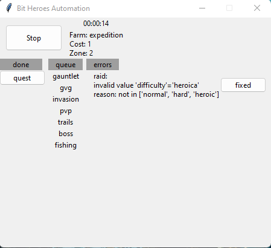
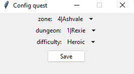

# Bit Heros Automation</h1>

## Support
**Version:** [Bit Heros on Steam](https://store.steampowered.com/app/666860/Bit_Heroes/)
 
**Resolution:** 800x480
 
**Language:** English

## Caution
- Mouse will be use during run
## Features

- Auto Fishing
- Auto Raid (currently boss 4, adding more later...)
- Auto Boss (auto join random lobby)
- Auto PVP
- Auto GVG
- Auto Gauntlet (use current difficulty selected)
- Auto Expedition (use current difficulty selected)
- Auto Trials (use current difficulty selected)
- Auto Quest (only big floor and currently max zone is z4f4)
- [Smart rerun mode](#smart-rerun-mode)
- Auto check reconnect when running

## Smart rerun mode

Run through list of queue first time, for spend first time run, make the energy recharging

And in the second run queue will use rerun for each farm in queue current mode

Except 'boss'
## Download

[Latest version]((https://github.com/ken2057/Bit-Heroes-Automation/releases))

## Usage

1. Edit config.json file
2. Run 'Bit Heros Automation'.exe 

## UI

- In the first row will Start/Stop automation, and display auto information 
- Each button of farm mode will open a dialog to config the mode 
  - Example: when click the 'Quest' button dialog config quest will popup:
    - 
- 'done' column:
  - Show which farm was done (out of energy/out of bait)
  - Click `>>` button to add the mode into the queue to farming
  - Click `>>>` to move all mode into queue
- 'queue' column:
  - Show automation order
  - Click `<<` button to move the mode into the done
  - Click `<<<` to move all mode into done
- 'errors' column:
  - If any config invalid in [config.json](./config.json) it will add into the 'errors' and after the config was corrected, click `fixed` button, it will be add back into 'queue'
  - 'errors' will not re-add into 'queue' when re-Start the run

## To do

- [x] Auto run 'Gauntlet'
- [x] Auto run 'Quest'
- [x] Basic UI
- [x] Config via UI
- [ ] Dynamic select zone for Expedition
- [ ] Add all zone & floor in 'Quest'
- [ ] Add all boss in 'Raid'

References:
- https://www.simple-ai.net/post/find-and-replace-in-image