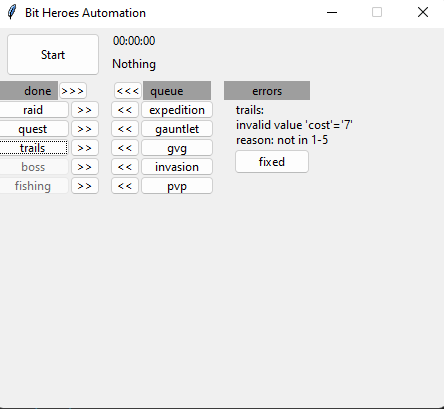

# Bit Heros Automation</h1>

## Support
**Version:** [Bit Heros on Steam](https://store.steampowered.com/app/666860/Bit_Heroes/)
 
**Resolution:** 800x480
 
**Language:** English

## Caution
- Mouse will be use during run
## Features

- Auto Fishing
- Auto Raid (currently boss 4, adding more later...)
- Auto Boss (auto join random lobby)
- Auto PVP
- Auto GVG
- Auto Gauntlet (use current difficulty selected)
- Auto Expedition (use current difficulty selected)
- Auto Trials (use current difficulty selected)
- Auto Quest (only big floor and currently max zone is z4f4)

## Usage

1. Edit config.json file
2. Run 'Bit Heros Automation'.exe 

## UI

- In the first row will Start/Stop automation, and display auto information
- 'done' column:
  - Show which farm was done (out of energy/out of bait)
  - Clickable to re-add into the queue to play
  - If automation was Stop and Start 'done' list will adding into 'queue'
- 'queue' column:
  - Show automation order
- 'errors' column:
  - If any config invalid in [config.json](./config.json) it will add into the 'errors' and after the config was corrected, click 'fixed' button, it will be add back into 'queue'
  - 'errors' will not re-add into 'queue' when re-Start the run

## To do

- [x] Auto run 'Gauntlet'
- [x] Auto run 'Quest'
- [x] Basic UI
- [ ] Add all zone & floor in 'Quest'
- [ ] Add all boss in 'Raid'
- [ ] Config via UI

References:
- https://www.simple-ai.net/post/find-and-replace-in-image